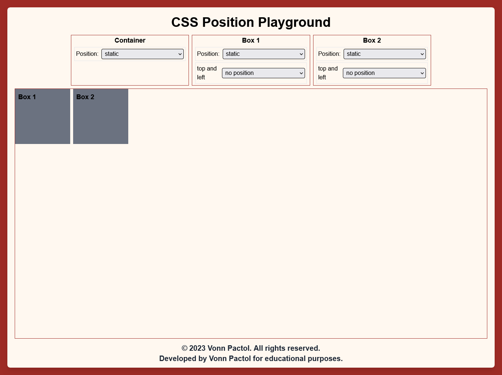

## Lesson 1 - Static

A static position is the default value. Elements with `position: static;` are positioned in the normal flow of the document. The top, right, bottom, and left properties have no effect on statically positioned elements.

```css
/* Syntax */
#container {
  position: static;
}

#box-one {
  position: static;
}

#box-two {
  position: static;
}
```



You don't need to put `position: static;` because it is the default value of HTML element.

### Exercise

NOTE: Remember to modify the given code in start folder. As much as possible, do not look at the final output folder. If you are done you can check and compare the results to final output folder if it is the same.

In the CSS file, Try to change the position of the `#box-two` into `static` and observe the changes.

```css
#box-two {
  height: 100px;
  width: 100px;
  border: 2px solid blue;
  position: absolute; /* change this to position: static*/
  bottom: 0;
}
```

Congratulations! You have now completed Lesson 1. Let's move on to the [next lesson](https://github.com/sharproyalz/css-position/blob/main/2_Lesson/README.md#lesson-2---relative).
