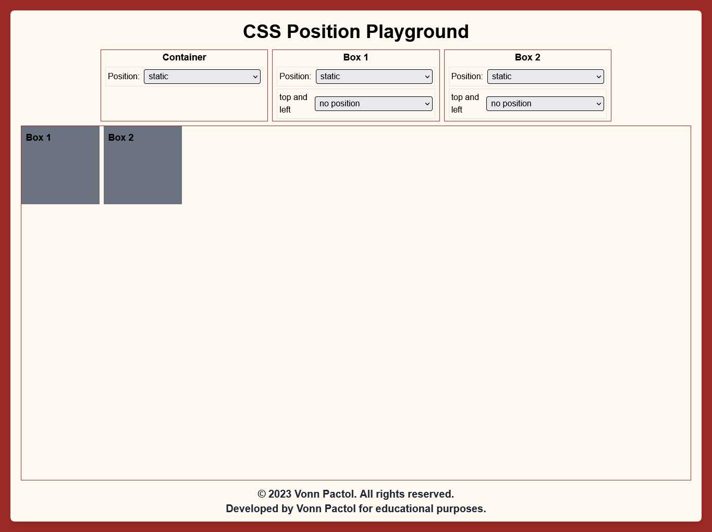

## Lesson 2 - Relative

A relatively positioned element is positioned relative to its normal position in the document flow. This means you can move it left, right, up, or down, and the space it occupies in the normal flow remains reserved. Imagine it is a static position but it can be move using left, right, up, or down.

```css
/* Syntax */
#container {
  position: static;
}

#box-one {
  position: relative;
  top: 20px;
  left: 20px;
}

#box-two {
  position: static;
}
```


### Exercise

NOTE: Remember to modify the given code in start folder and as much as possible do not look the final output folder.

Try to change the position of the box two into `static` and observe the changes.

```css
#box-two {
  height: 100px;
  width: 100px;
  border: 2px solid blue;
  position: absolute;
  bottom: 0;
}
```

Congratulations! You have now completed Lesson 1. Let's move on to the next lesson.

```css
/* Syntax */
#container {
  position: static;
}

#box-one {
  position: relative;
  top: 20px;
  left: 20px;
}

#box-two {
  position: static;
}
```



### NOTE

- using both `top` and `bottom`, top will override the bottom. Same with `left` and `right`, left will override the right.

### Exercise

NOTE: Remember to modify the given code in start folder and as much as possible do not look the final output folder. If you are done you can check and compare the results to final output folder if it is the same.

Try to add `top` with `40px` and `left` with `40px` to the position of the box one and observe the changes.

```css
#box-one {
  height: 100px;
  width: 100px;
  border: 2px solid red;
  position: relative;
  /* Enter your code below  */
}
```

Congratulations! You have now completed Lesson 2. Let's move on to the next lesson.
