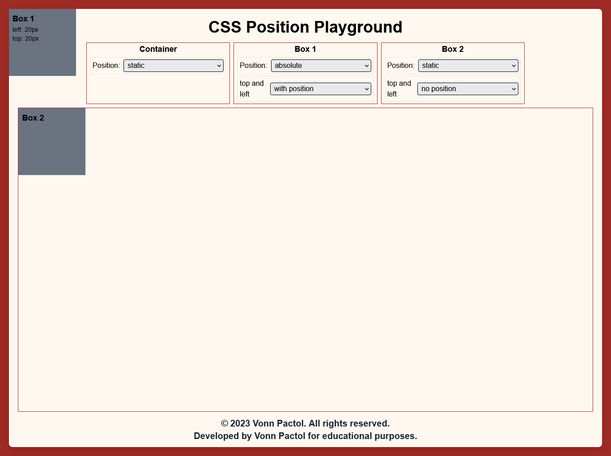
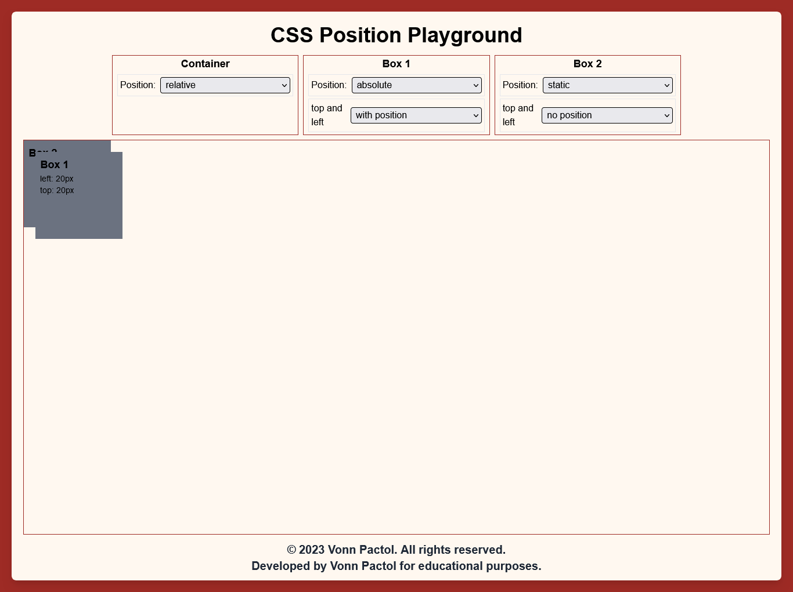

## Lesson 3 - Absolute

An absolutely positioned element is removed from the normal document flow and positioned relative to its closest positioned ancestor. If there is no positioned ancestor, it is positioned relative to the initial containing block (usually the <html> element).

```css
/* Syntax without positioned ancestor*/
#container {
  position: relative;
}

#box-one {
  position: absolute;
  top: 20px;
  left: 20px;
}

#box-two {
  position: static;
}
```

This is an example of an element that is `position: absolute;` without a positioned ancestor.



```css
/* Syntax without positioned ancestor*/
#container {
  position: relative;
}

#box-one {
  position: absolute;
  top: 20px;
  left: 20px;
}

#box-two {
  position: static;
}
```

This is an example of an element that is `position: absolute;` with a positioned ancestor.



### NOTE

- using both `top` and `bottom`, top will override the bottom. Same with `left` and `right`, left will override the right.

### Exercise

NOTE: Remember to modify the given code in start folder and as much as possible do not look the final output folder.

Try to add `left: 100px;` in the box one and observe the changes.

```css
#box-one {
  height: 100px;
  width: 100px;
  border: 2px solid red;
  position: absolute;
  top: 40px;
  right: 40px;
  /* Enter your code below */
}
```

Congratulations! You have now completed Lesson 3. Let's move on to the [next lesson](https://github.com/sharproyalz/css-position/blob/main/4_Lesson/README.md#lesson-4---sticky).
