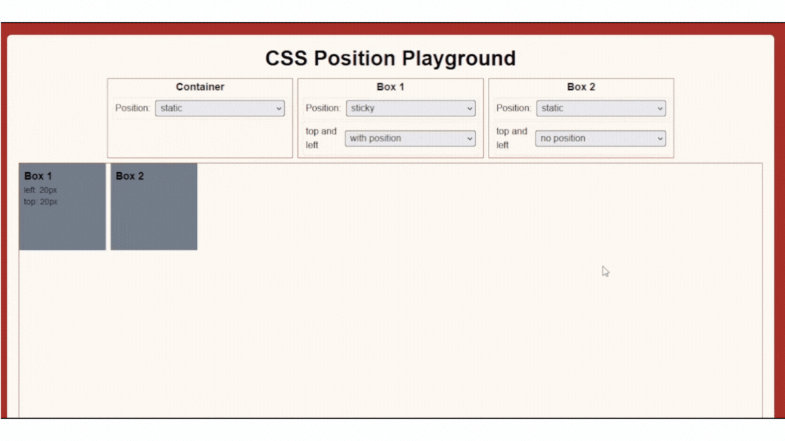

## Lesson 4 - Sticky

A sticky-positioned element is treated as relative positioned until it crosses a specified point during scrolling, after which it is treated as fixed. This is often used for creating navigation bars that stick to the top of the page after scrolling past a certain point.

```css
/* Syntax*/
#container {
  position: static;
}

#box-one {
  position: sticky;
  top: 20px;
  left: 20px;
}

#box-two {
  position: static;
}
```



Box one moved when I tried to scroll my screen to lower when reaching the `top:20px` of my screen.

### NOTE

- `position: sticky` will not work if top property is not defined.
- using both `top` and `bottom`, top will override the bottom. Same with `left` and `right`, left will override the right.

### Exercise

NOTE: Remember to modify the given code in start folder. As much as possible, do not look at the final output folder. If you are done you can check and compare the results to final output folder if it is the same.

In the CSS file, Try to add both `#box-one` and `#box-two` with `top` property with different pixels and observe the changes.

```css
#box-one {
  height: 100px;
  width: 100px;
  border: 2px solid red;
  position: sticky;
  /* Enter your code below */
}

#box-two {
  height: 100px;
  width: 100px;
  border: 2px solid blue;
  position: sticky;
  /* Enter your code below */
}
```

Congratulations! You have now completed Lesson 4. Let's move on to the [next lesson](https://github.com/sharproyalz/css-position/blob/main/5_Lesson/README.md#lesson-5---fixed).
