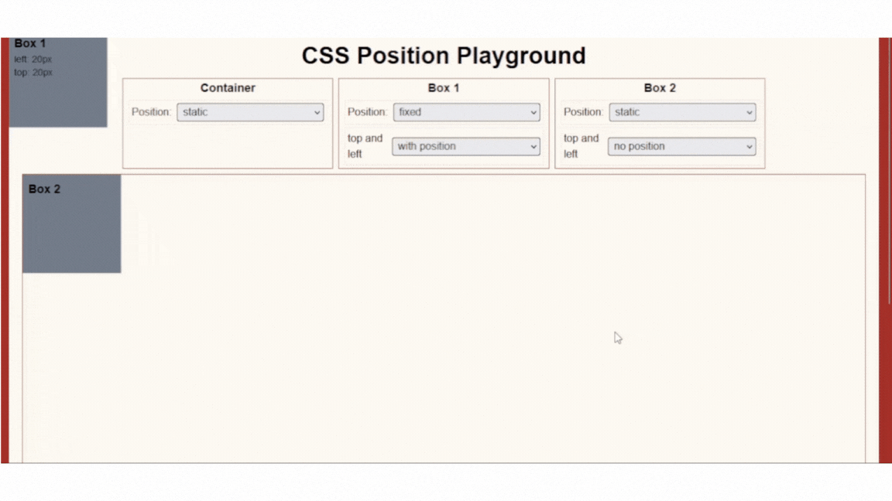

## Lesson 5 - Fixed

A fixed-position element is positioned relative to the browser window or the viewport. It will not move even if the page is scrolled.

```css
/* Syntax*/
#container {
  position: static;
}

#box-one {
  position: fixed;
}

#box-two {
  position: static;
}
```



Box one moved along in my screen when I tried to scroll.

### NOTE

- `position: fixed` behaves like a `position:absolute` when element doesn't have a position property (top, left, bottom, right), they are both removed from the normal document flow.
- unlike `position: sticky`, `position: fixed` will stay in the screen even if you don't set a `top` property.
- using both `top` and `bottom`, top will override the bottom. Same with `left` and `right`, left will override the right.

### Exercise

NOTE: Remember to modify the given code in start folder and as much as possible do not look the final output folder.

Try to add box one with `top` property of `40px` and observe the changes.

```css
#box-one {
  height: 100px;
  width: 100px;
  border: 2px solid red;
  position: fixed;
  /* Enter your code below */
}
```

Congratulations! You have now completed the final lesson. You are now one step ahead of becoming a front-end developer 🎉.
